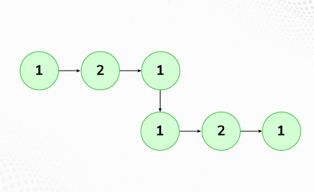
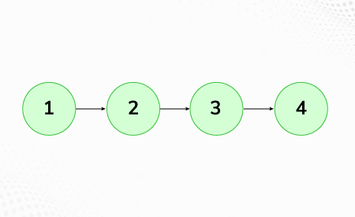

# Palindrome Linked List

Given a singly linked list of integers. The task is to check if the given linked list is palindrome or not.

Examples:

```
Input: LinkedList: 1->2->1->1->2->1
Output: true
Explanation: The given linked list is 1->2->1->1->2->1 , which is a palindrome and Hence, the output is true.
```



```
Input: LinkedList: 1->2->3->4
Output: false
Explanation: The given linked list is 1->2->3->4, which is not a palindrome and Hence, the output is false.
```



Expected Time Complexity: O(n)
Expected Auxiliary Space: O(1)
Note: You should not use the recursive stack space as well

Constraints:
1 <= number of nodes <= 105
1 ≤ node->data ≤ 103

## Solution

### Java

```java
class Solution {
    boolean isPalindrome(Node head) {
        Node slow = head, fast = head, prev=head;
        while(fast!=null && fast.next!=null){
            fast=fast.next.next;
            prev=slow;
            slow=slow.next;
        }
        Node b=null;
        prev.next=null;
        if(fast!=null)  b = reverse(slow.next);
        else    b = reverse(slow);
        Node a=head;
        while(a!=b && b!=null){
            if(a.data!=b.data)    return false;
            a=a.next;
            b=b.next;
        }
        return true;
    }
    Node reverse(Node root){
        if(root==null || root.next==null)   return root;
        Node temp = reverse(root.next);
        root.next.next=root;
        root.next=null;
        return temp;
    }
}
```

### JavaScript

```js
/**
 * @param {LinkedListNode} head
 * @returns {boolean}
 */

class LinkedListNode {
  constructor(data) {
    this.data = data;
    this.next = null;
  }
}

class Solution {
  // Function to check whether the list is palindrome.
  isPalindrome(head) {
    let slow = head,
      fast = head,
      prev = head;
    while (fast !== null && fast.next !== null) {
      fast = fast.next.next;
      prev = slow;
      slow = slow.next;
    }
    let b = null;
    prev.next = null;
    if (fast !== null) b = this.reverse(slow.next);
    else b = this.reverse(slow);
    let a = head;
    while (a !== b && b !== null) {
      if (a.data !== b.data) return false;
      a = a.next;
      b = b.next;
    }
    return true;
  }

  reverse(root) {
    if (root === null || root.next === null) return root;
    let temp = this.reverse(root.next);
    root.next.next = root;
    root.next = null;
    return temp;
  }
}
```
