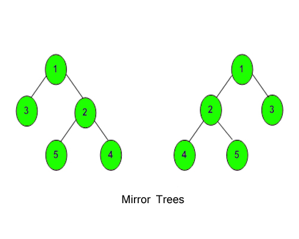

# Mirror Tree

Given a Binary Tree, convert it into its mirror.



Examples:

Input:

```
      1
    /  \
   2    3
Output: 3 1 2
Explanation: The tree is
  1    (mirror)   1
 /  \    =>        /  \
2    3          3    2

The inorder of mirror is 3 1 2
```

```
Input:
      10
     /  \
    20   30
   /  \
  40  60
Output: 30 10 60 20 40
Explanation: The tree is
      10               10
    /    \  (mirror)   /    \
   20    30    =>   30    20
  /  \                     /   \
 40  60                 60   40
The inroder traversal of mirror is: 30 10 60 20 40.
```

Expected Time Complexity: O(n)
Expected Auxiliary Space: O(height of the tree)

Constraints:
1 ≤ Number of nodes ≤ 105
1 ≤ Data of a node ≤ 105

## Solution :

### Java

```java

class Solution {
    // Function to convert a binary tree into its mirror tree.
    public void mirror(Node node) {
        // base case: if node is null, return
        if (node == null) {
            return;
        } else {
            // recursively call mirror on left and right subtrees
            mirror(node.left);
            mirror(node.right);

            // swap left and right child nodes
            Node temp = node.left;
            node.left = node.right;
            node.right = temp;
        }
    }
}
```

### JavaScript

```javascript
class Solution {
  // Function to convert a binary tree into its mirror tree.
  mirror(node) {
    // base case: if node is null, return
    if (node === null) {
      return;
    } else {
      // recursively call mirror on left and right subtrees
      this.mirror(node.left);
      this.mirror(node.right);

      // swap left and right child nodes
      let temp = node.left;
      node.left = node.right;
      node.right = temp;
    }
  }
}
```
