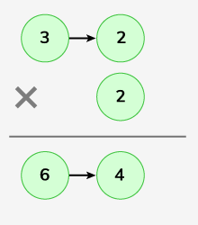
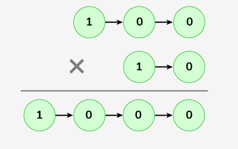

# Multiply two linked lists

Given elements as nodes of the two singly linked lists. The task is to multiply these two linked lists, say L1 and L2.

Note: The output could be large take modulo 10^9+7.

Examples :

```bash
Input: LinkedList L1 : 3->2 , LinkedList L2 : 2
Output: 64
Explanation:

Multiplication of 32 and 2 gives 64.
```

```bash
Input: LinkedList L1: 1->0->0 , LinkedList L2 : 1->0
Output: 1000
Explanation:

Multiplication of 100 and 10 gives 1000.
```

Expected Time Complexity: O(max(n,m))
Expected Auxilliary Space: O(1)
where n is the size of L1 and m is the size of L2

Constraints:
1 <= number of nodes <= 105
1 <= node->data <= 103

### Solution

#### Java

```java
class Solution {
    public long multiplyTwoLists(Node first, Node second) {
        // Calculate the numerical values of the two linked lists
        long a = value(first), b = value(second),
        // Define the modulo value to prevent overflow
        mod = (long)1e9+7;
        // Multiply the two numerical values and take the modulo
        return (a%mod * b%mod)%mod;
    }
    long value(Node node){
        // the result to 0
        long ans=0,
        // Define the modulo value to prevent overflow
        mod = (long)1e9+7;
        while(node!=null){
            // Multiply the current result by 10 and add the current node's value
            // Take the modulo to prevent overflow
            ans = (ans*10%mod + node.data)%mod;
            // Move to the next node
            node = node.next;
        }
        // Return the final result
        return ans;
    }
}
```

#### JavaScript

```js
/*LINKED LIST NODE
class Node {
  constructor(x){
    this.data = x;
    this.next = null;
  }
}
*/

/**
 * @param {Node} l1
 * @param {Node} l2
 * @return {number}
 */

// Use Bigint for javascript
class Solution {
  // Multiplies two numbers represented as linked lists.
  multiplyTwoLists(first, second) {
    // Convert the first linked list to a BigInt number
    let num1 = this.convertListToNumber(first);
    // Convert the second linked list to a BigInt number
    let num2 = this.convertListToNumber(second);
    // Multiply the two numbers and take the modulo to prevent overflow
    return Number((num1 * num2) % 1000000007n);
  }

  convertListToNumber(node) {
    // the result to 0
    let result = 0n;
    while (node !== null) {
      // Multiply the current result by 10 and add the current node's value
      result = result * 10n + BigInt(node.data);
      // Move to the next node
      node = node.next;
    }
    // Return the final result
    return result;
  }
}
```
