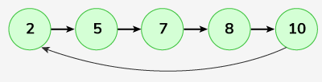

# Deletion and Reverse in Circular Linked List

Given a Circular Linked List. The task is to delete the given node, key in the circular linked list, and reverse the circular linked list.

Note:

You don't have to print anything, just return the head of the modified list in each function.
Nodes may consist of Duplicate values.
The key may or may not be present.
Examples:

```bash
Input: Linked List: 2->5->7->8->10, key = 8

Output: 10->7->5->2
Explanation: After deleting 8 from the given circular linked list, it has elements as 2, 5, 7, 10. Now, reversing this list will result in 10, 7, 5, 2, the resultant list is also circular.
```

```bash
Input: Linked List: 1->7->8->10, key = 8

Output: 10->7->1
Explanation: After deleting 8 from the given circular linked list, it has elements as 1, 7,10. Now, reversing this list will result in 10, 7, 1, the resultant list is also circular.
```

```bash
Input: Linked List: 3->6->4->10, key = 9
Output: 10->4->6->3
Explanation: As there no key present in the list, so simply reverse the list, the resultant list is also circular.
```

Expected Time Complexity: O(n)
Expected Auxillary Space: O(1)

Constraints:
2 <= number of nodes, key <= 105
1 <= node -> data <= 105

## Solution

### Java

```java
class Solution {
    //firstly Function to reverse the circular linked list

    Node reverse(Node head) {

        // Check if the list is empty or has only one node
        if (head == null || head.next == head) {
            return head; // No need to reverse; return as is
        }


        // Start with the node next to head
        Node curr = head.next;
        // This will hold the next node temporarily
        Node nxt = null;
        // This will point to the previous node
        Node prev = head;


        //I used Loop to reverse the links until we reach back to the head
        while (curr != head) {
            // Store the next node
            nxt = curr.next;
            // Reverse the current node next pointer to point to previous node
            curr.next = prev;
            // Move prev to the current node
            prev = curr;
            // Move to the next node in the order
            curr = nxt;
        }


        // After the loop, Connect the old head to the new head
        head.next = prev;
        //and return the new head
        return prev;
    }


    // Function to delete a node from the circular linked list
    Node deleteNode(Node head, int key) {

        // Check if the list is empty
        if (head == null) {
            // Return null if there nothing to delete
            return null;
        }


        // Set pointers to find the node to delete
        Node temp = head.next; // Start from the node next to head
        Node prev = head; // set prev to head


        // Check if the node to delete is the head
        if (head.data == key) {
            // If there is only one node in the list
            if (head.next == head) {
                // List becomes empty; return null
                return null;
            } else {
                // Find the last node in the circular list
                while (temp.next != head) {
                    prev = temp; // Move prev to the last node
                    temp = temp.next; // Move to the next node
                }
                // Update the last node next pointer to the new head
                temp.next = head.next; // Last node points to the second node
                head = head.next; // Move head to the next node (new head)
                return head; // Return new head
            }
        }


        // Look for the key in the rest of the list (not including head)
        while (temp != head && temp.data != key) {
            prev = temp; // Move prev to current node
            temp = temp.next; // Move to the next node
        }

        // If the node with the key was found
        if (temp != head) {
            // Bypass the node to delete it
            prev.next = temp.next;
        }

        // Return the head of the list
        return head;
    }
}
```

### JavaScript

```js
class Solution {
  // Function to reverse a circular linked list
  reverse(head) {
    // Check if the list is empty or has only one node
    if (head === null || head.next === head) {
      return head; // No need to reverse; return as is
    }

    let curr = head.next; // Start with the node next to head
    let nxt = null; // This will hold the next node temporarily
    let prev = head; // This will point to the previous node

    // Loop to reverse the links until we reach back to the head
    while (curr !== head) {
      nxt = curr.next; // Store the next node
      curr.next = prev; // Reverse the current node's next pointer to point to the previous node
      prev = curr; // Move prev to the current node
      curr = nxt; // Move to the next node in the order
    }

    // After the loop, connect the old head to the new head
    head.next = prev;
    // Return the new head
    return prev;
  }

  // Function to delete a node from the circular linked list
  deleteNode(head, key) {
    // Check if the list is empty
    if (head === null) {
      return null; // Return null if there is nothing to delete
    }

    let temp = head.next; // Start from the node next to head
    let prev = head; // Set prev to head

    // Check if the node to delete is the head
    if (head.data === key) {
      // If there is only one node in the list
      if (head.next === head) {
        return null; // List becomes empty; return null
      } else {
        // Find the last node in the circular list
        while (temp.next !== head) {
          prev = temp; // Move prev to the last node
          temp = temp.next; // Move to the next node
        }
        // Update the last node's next pointer to the new head
        temp.next = head.next; // Last node points to the second node
        head = head.next; // Move head to the next node (new head)
        return head; // Return new head
      }
    }

    // Look for the key in the rest of the list (not including head)
    while (temp !== head && temp.data !== key) {
      prev = temp; // Move prev to current node
      temp = temp.next; // Move to the next node
    }

    // If the node with the key was found
    if (temp !== head) {
      prev.next = temp.next; // Bypass the node to delete it
    }

    return head; // Return the head of the list
  }
}
```
