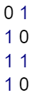
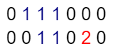

# Find the number of islands

Given a grid of size n\*m (n is the number of rows and m is the number of columns in the grid) consisting of '0's (Water) and '1's(Land). Find the number of islands.

Note: An island is either surrounded by water or the boundary of a grid and is formed by connecting adjacent lands horizontally or vertically or diagonally i.e., in all 8 directions.

Examples:

```bash
Input: grid = [[0,1],[1,0],[1,1],[1,0]]
Output: 1
Explanation:
The grid is-
```



```bash
All lands are connected.
```

```bash
Input: grid = [[0,1,1,1,0,0,0],[0,0,1,1,0,1,0]]
Output: 2
Expanation:
The grid is-
```

 

```bash
There are two islands :- one is colored in "blue" and other in "red".
```

Expected Time Complexity: O(n*m)
Expected Space Complexity: O(n*m)

Constraints:
1 ≤ n, m ≤ 500
grid[i][j] = {'0', '1'}

## Java

```java
class Solution {
    public int numIslands(char[][] grid) {
        // Get the dimensions of the grid
        int n = grid.length, m = grid[0].length, ans = 0;

        // Traverse through every cell in the grid
        for (int i = 0; i < n; i++) {
            for (int j = 0; j < m; j++) {
                // If the current cell contains land ('1')
                if (grid[i][j] == '1') {
                    // Increment the island count
                    ans++;
                    // Perform iterative DFS to mark all connected land cells
                    dfs(i, j, n, m, grid);
                }
            }
        }
        return ans;
    }

    // Direction array to explore all 8 possible neighboring cells
    int[][] dir = {{0,-1},{0,1},{1,0},{-1,0},{1,-1},{1,1},{-1,-1},{-1,1}};

    // Iterative DFS using a stack to avoid recursion depth issues
    void dfs(int i, int j, int n, int m, char[][] grid) {
        Stack<int[]> stack = new Stack<>();
        stack.push(new int[]{i, j});

        // Mark the starting land cell as visited by setting it to '0'
        grid[i][j] = '0';

        // Process each cell in the stack
        while (!stack.isEmpty()) {
            int[] cell = stack.pop();
            int x = cell[0], y = cell[1];

            // Explore all 8 possible directions
            for (int[] d : dir) {
                int newX = x + d[0], newY = y + d[1];

                // If the new cell is within bounds and is land ('1'), explore it
                if (newX >= 0 && newY >= 0 && newX < n && newY < m && grid[newX][newY] == '1') {
                    grid[newX][newY] = '0'; // Mark it as visited
                    stack.push(new int[]{newX, newY}); // Add the new cell to the stack
                }
            }
        }
    }
}
```
