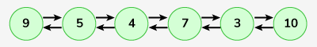

# XOR Linked List

An ordinary Doubly Linked List requires space for two address fields to store the addresses of previous and next nodes. A memory-efficient version of the Doubly Linked List can be created using only one space for the address field with every node. This memory-efficient Doubly Linked List is called XOR Linked List or Memory Efficient as the list uses bit-wise XOR operation to save space for one address.

Given a stream of data of size N for the linked list, your task is to complete the function insert() and getList(). The insert() function pushes (or inserts at the beginning) the given data in the linked list and the getList()  function returns the linked list as a list.

Note:

A utility function XOR() takes two Node pointers to get the bit-wise XOR of the two Node pointers. Use this function to get the XOR of the two pointers.
The driver code prints the returned list twice, once forward and once backwards.
Examples:

```bash
Input:
LinkedList: 9<->5<->4<->7<->3<->10
```


```bash
Output:
10 3 7 4 5 9
9 5 4 7 3 10
```

```bash
Input:
LinkedList: 58<->96<->31
```


```bash
Output:
31 96 58
58 96 31
```

Expected Time Complexity: O(n)
Expected Auxiliary Space: O(1)

Constraints:
1 <= number of nodes, data of nodes <= 105

## Solution
### Java
```java
// class Node {
//     int data;
//     Node npx;

//     Node(int x) {
//         data = x;
//         npx = null;
//     }
// }
class Solution {
    // function should insert the data to the front of the list
    static Node insert(Node head, int data) {
        // Code Here.
        // we create sepreate node first
         Node new_head = new Node(data);
         
         new_head.npx = head ;
         return new_head;
    }

    // function to print the linked list
    static ArrayList<Integer> getList(Node head) {
        // Code Here.
        // Intially current pointer is haed 
        Node curr = head;
        
        // create seprate array list you want to return list
        
        ArrayList<Integer> al = new ArrayList<>();
        
        while(curr != null){
            al.add(curr.data); // store value
            curr = curr.npx; // move to next
        }
        return al;
    }
}