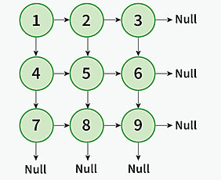
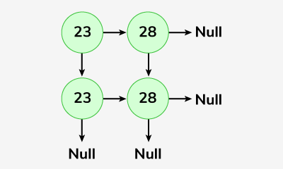

# Linked List Matrix

Given a Matrix mat of n\*n size. Your task is constructing a 2D linked list representation of the given matrix.

```bash
Input: mat = [[1, 2, 3], [4, 5, 6], [7, 8, 9]]
Output:

1 -> 2 -> 3
4 -> 5 -> 6
7 -> 8 -> 9
```



```bash
input: mat = [[23, 28], [23, 28]]
Output:
23 -> 28
23 -> 28
```



Expected Time Complexity: O(n2)
Expected Space Complexity: O(n2)

Constraints:
1 <= mat.size() <=15
1 <= mat[i][j] <=104

## Solution

### Java

```java
class Solution {
    static Node construct(int arr[][]) {
        // we have to find the length first
        int n = arr.length, m = arr.length;
        // we have function "Solve" using recursive manner approach
        return solve(0,0,n,m,arr);
    }
        static Node solve(int i,int j,int n,int m,int a[][]){
    // now we have base case if the index is out of bound (outside jr geli tr) return null
        if(i>= n || j>= m)
        return null;
        // we create a temporary node
        Node temp = new Node(a[i][j]);
        // Now there are two pointer right and down
        // right pointer point to same row and increment column
        temp.right = solve(i,j+1,n,m,a);
        temp.down = solve(i+1,j,n,m,a);
        // at the end we return temporary node
        return temp;
    }
}
```

### JavaScript

```js
class Solution {
  // Function to construct a 2D linked list from a 2D array
  constructLinkedMatrix(mat) {
    // Get the dimensions of the matrix
    const n = mat.length;
    const m = mat[0].length;

    // Call the recursive helper function to build the linked matrix
    return this.solve(0, 0, n, m, mat);
  }

  // Recursive function to build the linked matrix
  solve(i, j, n, m, mat) {
    // Base case: if the index is out of bounds, return null
    if (i >= n || j >= m) return null;

    // Create a temporary node for the current element
    const temp = new Node(mat[i][j]);

    // Set the right pointer (same row, next column)
    temp.right = this.solve(i, j + 1, n, m, mat);

    // Set the down pointer (next row, same column)
    temp.down = this.solve(i + 1, j, n, m, mat);

    // Return the created node
    return temp;
  }
}
```
