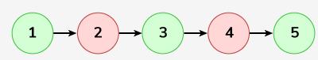

# Delete Alternate Nodes

Given a Singly Linked List, Delete all alternate nodes of the list ie delete all the nodes present in even positions.

Examples :

```bash
Input: LinkedList: 1->2->3->4->5->6
 
Output: 1->3->5

Explanation: Deleting alternate nodes ie 2, 4, 6 results in the linked list with elements 1->3->5.
```




```bash
Input: LinkedList: 99->59->42->20
 
Output: 99->42
```


Expected Time Complexity: O(n)
Expected Auxiliary Space: O(1)

Constraints:
1 <= number of nodes <= 105
1 <= node->data <= 103

### Solution 
#### Java
```java
class Solution {
    public void deleteAlt(Node head) {
        Node cur = head;
        while(cur!=null && cur.next!=null){
            cur.next = cur.next.next;
            cur = cur.next;
        }
    }
}
```
