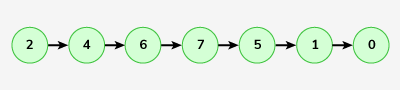

# Count Linked List Nodes

Given a singly linked list. The task is to find the length of the linked list, where length is defined as the number of nodes in the linked list.

Examples :

```bash
Input: LinkedList : 1->2->3->4->5

Output: 5
Explanation: Count of nodes in the linked list is 5, which is its length.
```


```bash
Input: LinkedList : 2->4->6->7->5->1->0

Output: 7
Explanation: Count of nodes in the linked list is 7. Hence, the output is 7.
```



Expected Time Complexity: O(n)
Expected Auxilliary Space: O(1)

Constraints:
1 <= number of nodes <= 105
1 <= node->data <= 103

### Solution

#### Java

```java
class Solution {
    // Function to count nodes of a linked list.
    public int getCount(Node head) {

        // Intially current node at head
        Node curr = head;
        // length is 0 first
        int n = 0;

        // curr is not null and pointing to a node then
        while(curr != null){

            // incremeant length of node and
            n++;
            // jump to the next node
            curr = curr.next;
        }

        return n;
    }
}
```

#### JavaScript

```js
class Solution {
  // Function to count nodes of a linked list.
  getCount(head) {
    // Initially, the current node is at head
    let curr = head;
    // Length is 0 at the beginning
    let n = 0;

    // While curr is not null and pointing to a node
    while (curr !== null) {
      // Increment the length of the node
      n++;
      // Move to the next node
      curr = curr.next;
    }

    // Return the total count of nodes
    return n;
  }
}
```
