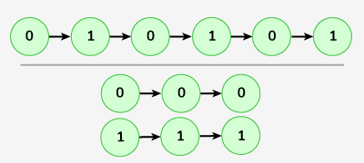

# Split Linked List Alternatingly

Given a singly linked list's head. Your task is to complete the function alternatingSplitList() that splits the given linked list into two smaller lists. The sublists should be made from alternating elements from the original list.
Note:

    - The sublist should be in the order with respect to the original list.
    - Your have to return an array containing the both sub-linked lists.

Examples:

```bash
Input: LinkedList = 0->1->0->1->0->1
Output: 0->0->0 , 1->1->1
Explanation: After forming two sublists of the given list as required, we have two lists as: 0->0->0 and 1->1->1.
```



```bash
Input: LinkedList = 2->5->8->9->6
Output: 2->8->6 , 5->9
Explanation: After forming two sublists of the given list as required, we have two lists as: 2->8->6 and 5->9.
```

```bash
Input: LinkedList: 7
Output: 7 , <empty linked list>
```

Constraints:
1 <= number of nodes <= 100
1 <= node -> data <= 104

### Solution

#### Java

```java
class Solution {
    // Function to append a new node with newData at the end of a linked list
    Node[] alternatingSplitList(Node head) {
        // code here

        if(head == null || head.next == null){
            return new Node[]{head, null};
        }

        Node h1 = head;
        Node t1 = head;

        Node h2 = head.next;
        Node t2 = head.next;


        while(t2 != null){
            t1.next = t2.next;
            t1 = t1.next;

            if(t1 != null){
                t2.next = t1.next;
            }
            t2 = t2.next;
        }

        return new Node[]{h1, h2};
    }
}
```
