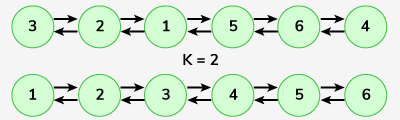
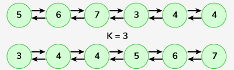

# Sort a k sorted doubly linked list

Given a doubly linked list, each node is at most k-indices away from its target position. The problem is to sort the given doubly linked list. The distance can be assumed in either of the directions (left and right).

Examples :

```bash
Input: Doubly Linked List : 3 <-> 2 <-> 1 <-> 5 <-> 6 <-> 4 , k = 2
Output: 1 <-> 2 <-> 3 <-> 4 <-> 5 <-> 6

Explanation: After sorting the given 2-sorted list is 1 <-> 2 <-> 3 <-> 4 <-> 5 <-> 6.
```



```bash
Input: Doubly Linked List : 5 <-> 6 <-> 7 <-> 3 <-> 4 <-> 4 , k = 3
Output: 3 <-> 4 <-> 4 <-> 5 <-> 6 <-> 7

Explanation: After sorting the given 3-sorted list is 3 <-> 4 <-> 4 <-> 5 <-> 6 <-> 7.
```



Expected Time Complexity: O(n\*logk)
Expected Auxiliary Space: O(k)
Constraints:
1 <= number of nodes <= 105
1 <= k < number of nodes
1 <= node->data <= 109

### Solution

#### Java

```java
class Solution {
    public DLLNode sortAKSortedDLL(DLLNode head, int k) {
        PriorityQueue<DLLNode> pq = new PriorityQueue<>((o1,o2)->o1.data-o2.data);

        DLLNode cur_head = head;
        DLLNode ans = null, cur_ans = null;
        while(cur_head!=null){
            pq.add(cur_head);

            if(pq.size()==k+1){
                DLLNode pop = pq.remove();
                if(ans==null){
                    ans = pop;
                    cur_ans=pop;
                }else{
                    cur_ans.next = pop;
                    pop.prev = cur_ans;
                    cur_ans = cur_ans.next;
                }
            }


            cur_head = cur_head.next;
        }

        while(!pq.isEmpty()){
            DLLNode pop = pq.remove();
            if(ans==null){
                ans = pop;
                cur_ans=pop;
            }else{
                cur_ans.next = pop;
                pop.prev = cur_ans;
                cur_ans = cur_ans.next;
            }
        }

        ans.prev = null;
        cur_ans.next = null;

        return ans;
    }
}
```
