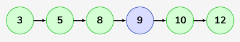
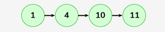
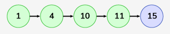

# Insert in Sorted way in a Sorted DLL

Given a sorted doubly linked list and an element x, you need to insert the element x into the correct position in the sorted Doubly linked list(DLL).

Note: The DLL is sorted in ascending order

**Example:**

```bash
Input: LinkedList: 3->5->8->10->12 , x = 9

Output: 3->5->8->9->10->12

Explanation: Here node 9 is inserted in the Doubly Linked-List.
```




```bash
Input: LinkedList: 1->4->10->11 , x = 15

Output: 1->4->10->11->15
```




**Constraints:**
1 <= number of nodes <= 103
1 <= node -> data , x <= 104

### Solution

#### Java

```java
class Solution {
    public Node sortedInsert(Node head, int x) {
        // Create a new node with the given value x
        Node node = new Node(x);

        // Case 1: Insert at the beginning if x is smaller than the head's data
        if (x < head.data) {
            node.next = head;      // Point the new node's next to current head
            head.prev = node;      // Update the previous of head to new node
            return node;           // New node is the new head now
        }

        // Case 2: Insert somewhere in the middle or at the end
        Node cur = head;           // Start from the head

        // Traverse until we find the right position for insertion
        while (cur.next != null && cur.next.data < x) {
            cur = cur.next;
        }

        // Insert the new node after the 'cur' node
        node.next = cur.next;      // New node points to the next node of 'cur'
        node.prev = cur;           // New node's previous is the 'cur' node
        cur.next = node;           // 'cur' node's next now points to the new node

        // Check if there is a node after the new node and update its previous
        if (node.next != null) {
            node.next.prev = node; // Update the next node's previous to the new node
        }

        return head;               // Return the head of the updated list
    }
}
```
