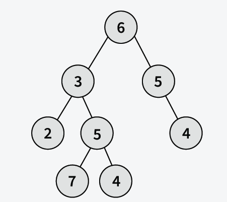
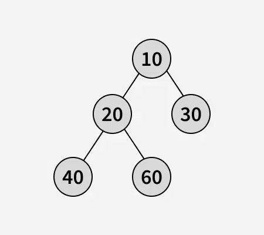

# Root to leaf paths sum

Given a binary tree, where every node value is a number. Find the sum of all the numbers that are formed from root to leaf paths. The formation of the numbers would be like 10\*parent + current (see the examples for more clarification).

**Examples:**



```bash
Input :

Output: 13997
Explanation : There are 4 leaves, resulting in leaf path of 632, 6357, 6354, 654 sums to 13997.
```



```bash
Input :

Output : 2630
Explanation: There are 3 leaves, resulting in leaf path of 1240, 1260, 130 sums to 2630.
```

```bash
Input :
           1
          /
         2
Output : 12
Explanation: There is 1 leaf, resulting in leaf path of 12.
```

Constraints:
1 ≤ number of nodes ≤ 31
1 ≤ node->data ≤ 100

### Solution

#### Java

```java
class Solution {
    public static int treePathsSum(Node root) {
        return preOrder(root,0);
    }
    static int preOrder(Node node,int val){
        if(node==null)  return 0;
        val = val*10+node.data;

        if(node.left==null && node.right==null) return val;

        return preOrder(node.left,val) + preOrder(node.right,val);
    }
}
```

